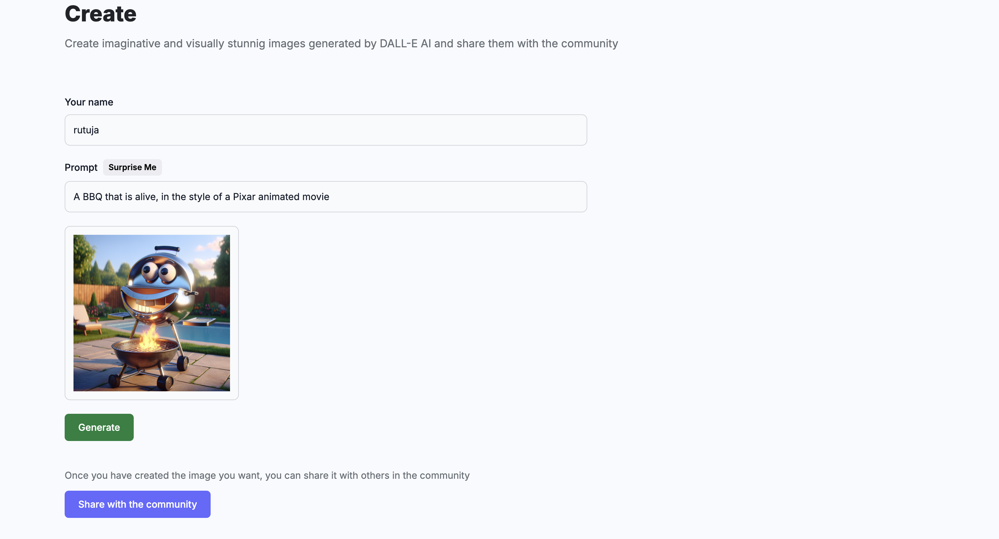
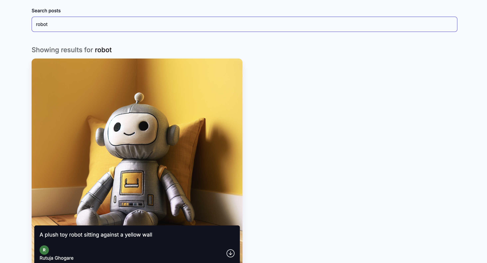

Image Generation App - DALL-E Clone

- Dive into the fascinating world of artificial intelligence to create tools inspired by MidJourney and DALL-E. These tools are designed to generate everything from memes and art to stunning UI/UX designs.

* MERN Stack: Node.js, Express.js, MongoDB, and React.js combined to form a robust full-stack framework.
* Tailwind CSS: The leading utility-first CSS framework used for rapid UI development.
* OpenAI's DALL-E Model: An advanced deep learning model for generating images from textual descriptions.
* Cloudinary: A cloud-based image storage service that enhances media management capabilities.

- Below are some Screen shots of the images generated from the app and the UI of the application

To run this project follow these steps:
* make sure you have react installed
* git clone
* cd client
* npm i
* npm run dev
* cd server
* npm i
* npm start

